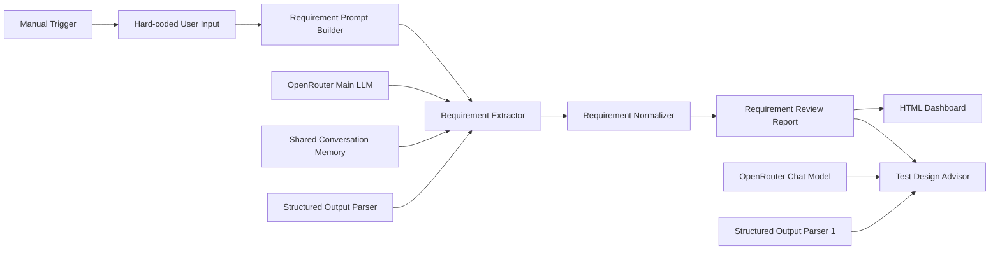
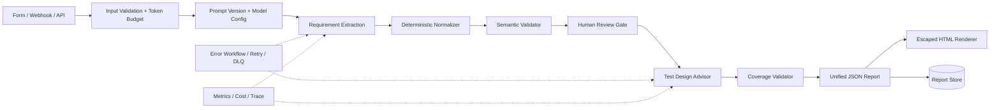

# Executive Summary

| Параметр | Значение |
|---|---|
| Проект | QA-AI-LAB |
| Репозиторий | https://github.com/Dantesssinferno/QA-AI-LAB |
| Ветка / commit | `main` / `c3d769816cc2` |
| Дата аудита | 2026-08-03 |
| Формат аудита | Статический анализ репозитория + инфраструктурный smoke-test |
| Изменения кода | Не выполнялись |

## Общая оценка проекта

QA-AI-LAB — перспективный proof of concept для автоматизированного QA-анализа требований. Идея логична: принять текст задачи, извлечь структурированные требования, оценить их качество, сформировать review-отчёт, предложить test-design techniques и показать результат в HTML.

Текущая реализация подтверждает жизнеспособность направления, но пока остаётся учебным прототипом, а не воспроизводимым инструментом. Базовая инфраструктура запускается, PostgreSQL и n8n работают, JSON workflow и обе JSON Schema синтаксически валидны. При этом основной AI-конвейер не прошёл end-to-end проверку и в чистом окружении фактически не готов к запуску: workflow не импортируется автоматически, экспорт ссылается на credential другого экземпляра n8n, а узел `Test Design Advisor` не получает входной отчёт.

## Общий рейтинг

**4/10 — качественная идея и полезный прототип, но низкая готовность к надёжному использованию.**

| Измерение | Оценка | Комментарий |
|---|---:|---|
| Ценность идеи | 8/10 | Автоматизация requirement review и трассировки до тест-дизайна решает реальную QA-задачу. |
| Архитектурная ясность | 6/10 | Стадии логично разделены, но контракты между ними нарушены, а финальные ветки не объединены. |
| Корректность реализации | 3/10 | Найден критический разрыв входа Advisor, потеря данных в dashboard и неверные readiness/quality-сигналы. |
| Безопасность | 3/10 | Неэкранированный HTML, общий memory key, публичный PostgreSQL и слабый пример пароля. |
| Воспроизводимость | 2/10 | README не описывает `.env`, импорт workflow, credential и фактический запуск. |
| Тестируемость | 2/10 | Нет тестов, CI, golden dataset и ожидаемого результата для единственного примера. |
| Production readiness | 2/10 | Нет API, error workflow, observability, pinning, backup/recovery и модели масштабирования. |

## Главные достоинства

- Проблема и продуктовая ценность сформулированы понятно.
- Конвейер разделён на extraction, normalization, review, визуализацию и test-design advice.
- Structured Output Parser используется на обеих LLM-стадиях.
- Workflow JSON корректно парсится; 13 имён узлов уникальны, отсутствующих целей в графе нет.
- Обе встроенные JSON Schema синтаксически валидны.
- Есть содержательный пример требования, охватывающий UI, API, БД, безопасность и stateful-сценарии.
- Реальных API-ключей в отслеживаемых файлах не найдено; `.env` исключён из Git.
- Инфраструктурный smoke-test успешен: Docker Engine, Compose, PostgreSQL и n8n запускаются.

## Главные недостатки

- `Test Design Advisor` физически подключён к report, но его prompt статический и не содержит входных данных.
- Чистый клон не воспроизводим по README и не импортирует workflow в n8n.
- Один постоянный `sessionKey` смешивает контекст независимых анализов.
- HTML напрямую интерполирует пользовательские и LLM-данные, создавая XSS-вектор.
- Dashboard читает `implicit` и `dependencies` не из тех путей и теряет данные.
- Нет семантической проверки Requirement ID, coverage, confidence и агрегированных metrics.
- Нет тестов, CI, error handling, observability, API-контракта и version pinning.
- README заявляет planned-компоненты, а runtime уже сообщает отсутствующий `Checklist Generator` как `Ready`.

## Фактический runtime-статус на дату аудита

| Проверка | Результат |
|---|---|
| Docker Desktop | 4.84.0 |
| Docker Engine | 29.6.2, Linux containers |
| Docker Compose | 5.3.1 |
| `docker run --rm hello-world` | PASS |
| `docker compose config --quiet` | PASS с предупреждением об устаревшем поле `version` |
| PostgreSQL | 16.14, `pg_isready` PASS, read-only SELECT PASS |
| n8n | 2.32.7 |
| n8n `/healthz` | HTTP 200, `{"status":"ok"}` |
| Restart count контейнеров в момент проверки | 0 |
| Workflow в базе n8n | Отсутствует; mount JSON не является импортом |
| OpenRouter E2E | BLOCKED: нет рабочего credential/API key mapping |

> **Ключевое ограничение интерпретации:** успешный `healthz` подтверждает только работоспособность процесса n8n и его подключения к PostgreSQL. Он не доказывает выполнение workflow, вызов OpenRouter, корректность отчёта или HTML.

---

# Architecture Review

## Текущая архитектура



Workflow содержит 13 узлов и 12 фактических связей. Визуализация и Advisor расходятся в две терминальные ветки и обратно не объединяются. Основные доказательства находятся в `n8n/workflows/requirement-analysis-workflow.json:5-212` и `:225-361`.

## Оценка компонентов

| Компонент | Сильная сторона | Проблема | Доказательство |
|---|---|---|---|
| Trigger/Input | Прост для демонстрации | Только Manual Trigger; задача жёстко зашита | workflow `:5-36` |
| Prompt Builder | Отделяет сбор prompt от agent node | Фактический prompt остаётся внутри export JSON | workflow `:115-118` |
| Requirement Extractor | Имеет LLM, parser и формальный output contract | Нет input preflight, system/data isolation и обработки ошибок | workflow `:89-118` |
| Conversation Memory | Технически подключена корректно | Не нужна для one-shot extraction и использует общий ключ | workflow `:59-72`, `:259-268` |
| Normalizer | Централизует IDs, статистику и scoring | Смешивает normalization с недоказанными эвристиками | workflow `:135` |
| Review Report | Создаёт понятную доменную структуру | Объявляет несуществующий следующий шаг готовым | workflow `:148` |
| HTML Dashboard | Даёт читаемый артефакт | Контракт путей нарушен; escaping отсутствует | workflow `:161` |
| Test Design Advisor | Идея отделена от extraction | Не получает входной report | workflow `:173-186` |
| PostgreSQL | Поддерживаемая БД для n8n | Нет healthcheck, backup, role separation | `docker-compose.yml:4-20` |
| Docker Compose | Минимальный локальный bootstrap | Не обеспечивает готовность, import и безопасные defaults | `docker-compose.yml:1-55` |

## Архитектурные достоинства

- Стадии имеют понятные имена и в целом соответствуют pipeline processing.
- LLM и output parser оформлены отдельными узлами, что допускает замену модели.
- Нормализованный report создаёт основу для будущей трассировки.
- PostgreSQL вынесен в отдельный сервис, а n8n использует внутреннее DNS-имя `postgres`.
- Workflow не активен и использует Manual Trigger, что безопаснее для учебного прототипа.

## Архитектурные дефекты

1. **Нет стабильного контракта между стадиями.** Report Builder записывает данные в `report.requirements.*`, HTML читает часть значений из корня, а Advisor не получает report вообще.
2. **Нет единого финального результата.** HTML и Advisor терминальны; отсутствует Merge/response/artifact stage.
3. **Source of truth размыт.** Prompts живут в JSON, файлы `docs/prompts/*.md` пусты, sample продублирован в docs и workflow.
4. **Доменный сервис отсутствует.** Нет внешнего входа, API, версии контракта, persistence отчётов и явной модели состояния анализа.
5. **LLM-инварианты делегированы самой LLM.** Schema проверяет форму, но не существование ID, полное coverage и согласованность metrics.
6. **Runtime и исходники смешаны.** Весь `./n8n` монтируется как `/home/node/.n8n`, поэтому source-файлы, config, storage и logs живут в одном дереве.

## Рекомендуемая целевая архитектура



Главный принцип целевой схемы: LLM предлагает содержание, а код проверяет все измеримые инварианты.

---

# Code Quality

## Общая оценка

Качество локальной логики неоднородно. Code nodes содержат полезные вспомогательные функции, структурированные комментарии и явные секции, но хранятся как большие escaped-строки внутри JSON. Один только HTML node содержит около 27,5 тыс. символов JavaScript на одной физической строке export-файла (`workflow:161`), что резко ухудшает diff, review, linting и unit testing.

## Положительные наблюдения

- Используются `const`, небольшие helper-функции и защитные значения по умолчанию.
- Нормализация категорий и присвоение префиксов централизованы.
- Structured Output Parser сокращает вероятность полностью неструктурированного ответа.
- Workflow graph статически целостен.
- `n8n/nodes/package.json` минимален и не маскирует лишние зависимости.

## Проблемы качества

| ID | Проблема | Последствие | Доказательство |
|---|---|---|---|
| CQ-01 | Три больших Code node встроены в JSON | Сложный review, отсутствие lint/test tooling | workflow `:135`, `:148`, `:161` |
| CQ-02 | Пять prompt-файлов имеют размер 0 байт | Документация выглядит существующей, но не управляет runtime | `docs/prompts/*.md` |
| CQ-03 | Sample продублирован | Изменения могут рассинхронизироваться | `docs/examples/task-01.md` и workflow `:22` |
| CQ-04 | Магические веса и пороги scoring | Числа выглядят объективными без статистической валидации | workflow `:135` |
| CQ-05 | IDs зависят от позиции | Малое изменение ответа перенумеровывает требования | workflow `:135` |
| CQ-06 | `$input.first()` используется в трёх стадиях | Batch silently drops все items после первого | workflow `:135`, `:148`, `:161` |
| CQ-07 | Model/temperature явно не заданы | Поведение зависит от defaults установленной версии node | workflow `:39-42`, `:189-192` |
| CQ-08 | Имя workflow учебное | Снижает обнаруживаемость и вводит в заблуждение | workflow `:2` |
| CQ-09 | Нет scripts, formatter, linter, typecheck | Ошибки выявляются только вручную/runtime | `n8n/nodes/package.json:1-5` |
| CQ-10 | Runtime-файл `n8n/crash.journal` не совпадает с ignore-pattern | После запуска появляется Git-шум | `.gitignore:14`, `:27-28` |

## Ошибки quality metrics

Формулы в Normalizer проверяют наличие хотя бы одного элемента в восьми категориях, а не полноту исходного требования. Наличие `dependencies`, `constraints` или `risks` всегда повышает completeness, хотя их отсутствие может быть корректным. Testability стартует с 40, а confidence — со 100.

Для полностью пустого структурированного результата статически получается:

| Метрика | Значение |
|---|---:|
| Confidence | 100 |
| Completeness | 0 |
| Testability | 40 |
| Requirements maturity | 42 |
| Exploratory testing | recommended |
| Manual review | not recommended |

Это внутренне противоречивый результат: пустой анализ не должен иметь максимальную уверенность и обходить manual review.

---

# Security Review

## Модель угроз

Система обрабатывает потенциально недоверенный текст требований, отправляет его внешнему LLM-провайдеру, сохраняет результаты в n8n/PostgreSQL и генерирует HTML. Поэтому доверительными границами являются:

1. пользовательский текст → LLM prompt;
2. LLM output → parser/code;
3. report → HTML/browser;
4. host/network → n8n/PostgreSQL;
5. repository/env → credentials;
6. OpenRouter → внешняя обработка данных.

## Находки

| ID | Severity | Находка | Доказательство | Риск |
|---|---:|---|---|---|
| SEC-01 | Critical | Динамические строки вставляются в HTML без escaping | workflow `:161` | Выполнение script/event-handler при открытии отчёта |
| SEC-02 | High | Один memory key для всех запусков | workflow `:61-63` | Утечка контекста между задачами/пользователями |
| SEC-03 | High | PostgreSQL опубликован на всех интерфейсах | `docker-compose.yml:19-20`; runtime `0.0.0.0` и `[::]` | Сетевая атака на БД |
| SEC-04 | High | Пример задаёт пароль `password` | `.env.example:7` | Опасный copy-paste default |
| SEC-05 | High | User data интерполируется в управляющий prompt без отдельной доверительной границы | workflow `:115-118` | Prompt injection и нарушение инструкций |
| SEC-06 | High | Нет политики чувствительных данных перед OpenRouter | README и workflow | Передача PII/секретов третьей стороне |
| SEC-07 | Medium | n8n порт также опубликован на всех интерфейсах | `docker-compose.yml:29-30` | Лишняя поверхность атаки локального инструмента |
| SEC-08 | Medium | Image `n8nio/n8n:latest` не закреплён | `docker-compose.yml:23` | Supply-chain/upgrade drift |
| SEC-09 | Medium | Нет network policy, resource limits, `read_only`, `cap_drop`, `security_opt` | `docker-compose.yml:3-55` | Повышенный blast radius |
| SEC-10 | Medium | Нет content-size limit и preflight | workflow `:16-118` | Cost/availability abuse и parser failures |
| SEC-11 | Medium | Нет CSP в HTML | workflow `:161` | Усиление последствий HTML injection |
| SEC-12 | Low | Экспорт содержит локальный credential ID | workflow `:52-56`, `:202-206` | Не секрет, но связывает export с чужим instance |

## Деталь SEC-01: доказанный XSS-вектор

`renderList` вставляет `item`, `item.id`, `item.text`, ключи и значения объектов напрямую. `renderQuestions` делает то же с вопросами, а `summaryText` также интерполируется без sanitizer. Пример негативного теста:

```html

```

Этот payload должен отображаться как текст. В текущей реализации он попадёт в HTML-разметку.

## Положительные наблюдения безопасности

- Реальный OpenRouter API key в tracked-файлах не найден.
- `.env` присутствует в `.gitignore`.
- Credential ID и имя из export не являются секретом сами по себе.
- Workflow `active:false` и Manual Trigger уменьшают риск непреднамеренного публичного запуска.
- PostgreSQL и n8n на smoke-test стартовали без restart loop.

---

# Performance Review

## Основные узкие места

| ID | Проблема | Проявление | Доказательство |
|---|---|---|---|
| PERF-01 | Нет оценки token budget входа | Длинный документ может обрезать output или вызвать parser failure | Main LLM `maxTokens: 3000`, workflow `:39-42` |
| PERF-02 | Advisor допускает до 11 000 output tokens | Высокая latency и стоимость одного запуска | workflow `:189-192` |
| PERF-03 | Нет chunking/map-reduce | Размер задачи ограничивает применимость | workflow `:16-118` |
| PERF-04 | Нет cache по hash входа/prompt/model | Повторный анализ снова оплачивает оба LLM-вызова | весь workflow |
| PERF-05 | Shared memory добавляет нерелевантный контекст | Рост токенов и деградация качества | workflow `:59-72` |
| PERF-06 | Нет timeout/retry/backoff policy на уровне workflow | Provider timeout блокирует execution | workflow settings `:364-367` |
| PERF-07 | `$input.first()` исключает batch processing | Невозможно эффективно обрабатывать очередь документов | workflow `:135`, `:148`, `:161` |
| PERF-08 | Нет CPU/memory/PID limits контейнеров | Один процесс может вытеснить остальные | `docker-compose.yml` |
| PERF-09 | Весь n8n state bind-mounted в синхронизируемый каталог | Дополнительный I/O и file-locking risk | `docker-compose.yml:51-52` |

## Наблюдение по host resources

На тестовом Windows-хосте существовал глобальный WSL limit `memory=24700MB` при 31,9 ГБ RAM. Docker видел около 23,6 ГиБ доступной памяти, а Windows pagefile вырос так, что свободное место на C: кратковременно снизилось примерно до 0,54 ГиБ. После `wsl --shutdown` место восстановилось примерно до 37,8 ГиБ.

Это **не дефект репозитория**, а эксплуатационный риск конкретной среды. Однако отсутствие resource limits и документации по требованиям к Docker/WSL усиливает проблему.

## Рекомендованные целевые метрики

- P95 времени extraction и Advisor отдельно.
- Входные/output tokens и стоимость на execution.
- Schema pass rate.
- Retry rate по HTTP 429/5xx.
- Доля truncation/parser failures.
- Cache hit rate.
- Queue wait time и active executions.
- Memory/CPU per worker.

---

# Database Review

## Фактическая роль БД

PostgreSQL используется как системная БД n8n, а не как доменная БД QA-отчётов. В репозитории нет собственных migrations, domain schema, ORM или retention policy.

## Положительные наблюдения

- Используется поддерживаемая major-ветка PostgreSQL 16.
- n8n обращается к БД по внутреннему service name `postgres`.
- Данные вынесены из container layer в persistent bind mount.
- Runtime-проверка `pg_isready` и SELECT прошла на PostgreSQL 16.14.

## Находки

| ID | Severity | Находка | Последствие | Доказательство |
|---|---:|---|---|---|
| DB-01 | High | Порт 5432 опубликован наружу | Необязательная удалённая поверхность атаки | `docker-compose.yml:19-20` |
| DB-02 | High | Example password слабый | Опасная конфигурация по умолчанию | `.env.example:7` |
| DB-03 | Medium | Начальный пользователь одновременно используется приложением | Нет разделения admin/app privileges | `docker-compose.yml:11-14`, `:39-43` |
| DB-04 | Medium | Нет healthcheck | `depends_on` задаёт порядок, но не готовность | `docker-compose.yml:54-55` |
| DB-05 | Medium | Нет backup/restore runbook | Потеря workflows, credentials и history | README |
| DB-06 | Medium | Host bind mount вместо managed volume | Permissions, OneDrive sync и переносимость | `docker-compose.yml:16-17` |
| DB-07 | Medium | Нет connection-pool/tuning/resource settings | Неопределённое поведение под нагрузкой | `docker-compose.yml:32-49` |
| DB-08 | Low | Tag `postgres:16` плавает по minor/patch | Upgrade без зафиксированной проверки | `docker-compose.yml:5` |
| DB-09 | Low | Нет доменной модели для versioned reports | Сложно сравнивать анализы и строить traceability | отсутствие migrations/schema |

## Минимальная целевая модель хранения

Для развития продукта целесообразно отделить runtime-таблицы n8n от доменных сущностей:

- `analysis_run`: input hash, source, status, timestamps;
- `prompt_version` и `model_config`;
- `requirement`: stable ID, source span, type, normalized text;
- `finding`: ambiguity/risk/missing information;
- `test_strategy` и `coverage_link`;
- `artifact`: JSON/HTML/checklist/test case;
- `evaluation_result`: precision/recall/schema/coverage metrics;
- `audit_event`: actor, stage, decision, error.

---

# API Review

## Текущее состояние

У проекта **нет внешнего API**. Вход формируется узлом `User Input`, запускается Manual Trigger и содержит жёстко зашитую sample-задачу (`workflow:5-36`). Отсутствуют Webhook/Form/Chat trigger, authentication, versioned request/response schema, idempotency и стандартная error model.

## Что фактически является внешней интеграцией

- OpenRouter вызывается через два n8n model nodes.
- `OPENROUTER_API_KEY` и `OPENROUTER_MODEL` объявлены в `.env.example:1-3`, но Compose не передаёт их контейнеру и workflow их не использует.
- Workflow export ссылается на credential ID исходного n8n instance (`workflow:52-56` и `:202-206`).

## Оценка будущего API-контракта

Минимальный запрос:

```json
{
  "source_id": "JIRA-123",
  "text": "Requirement text",
  "locale": "ru",
  "requested_outputs": ["review", "test_strategy"],
  "prompt_version": "req-extractor-v1"
}
```

Минимальный ответ должен содержать:

- `analysis_id` и version;
- `status`: queued/running/needs_review/completed/failed;
- normalized requirements со stable IDs и source spans;
- findings и confidence provenance;
- test strategy с валидированным coverage;
- model/prompt metadata;
- warnings, partial failures и error code;
- ссылки на JSON/HTML artifacts.

## Отсутствующие API-свойства

| Свойство | Статус |
|---|---|
| Входная валидация | Нет |
| Ограничение размера | Нет |
| Authentication/authorization | Нет |
| Versioning | Нет |
| Idempotency | Нет |
| Async job status | Нет |
| Error schema | Нет |
| Rate limiting | Нет |
| Audit/correlation ID | Нет |
| Data classification/consent | Нет |
| Unified output | Нет |

---

# Infrastructure / DevOps

## Результаты smoke-test

| ID | Проверка | Статус | Комментарий |
|---|---|---:|---|
| INF-T01 | Проверка SHA-256 официального Docker Desktop installer | PASS | Хеш совпал с опубликованным installer metadata |
| INF-T02 | Docker client ↔ daemon | PASS | Linux context `desktop-linux` |
| INF-T03 | Одноразовый `hello-world` | PASS | Pull/create/run/remove выполнены |
| INF-T04 | Compose render | PASS | Конфигурация валидна |
| INF-T05 | PostgreSQL startup/readiness/query | PASS | 16.14, соединение и SELECT успешны |
| INF-T06 | n8n startup | PASS | 2.32.7, restart count 0 в момент проверки |
| INF-T07 | n8n health endpoint | PASS | HTTP 200 |
| INF-T08 | Workflow import | FAIL / NOT IMPLEMENTED | В базе n8n workflow отсутствует |
| INF-T09 | OpenRouter workflow execution | BLOCKED | Credential/API key не настроены |

## Находки DevOps

| ID | Severity | Находка | Доказательство |
|---|---:|---|---|
| INF-01 | Critical | `docker compose up -d` не приводит к работающему AI-проекту | `README.md:19-27`, workflow не импортируется |
| INF-02 | High | `.env.example` неполный: нет `N8N_HOST` и `TZ` | Compose `:45`, `:49` против env example |
| INF-03 | High | OpenRouter env-переменные являются dead configuration | `.env.example:1-3`; Compose/workflow их не читают |
| INF-04 | High | Нет import/init service для workflow | `docker-compose.yml:3-55` |
| INF-05 | High | Нет healthchecks | оба services в `docker-compose.yml` |
| INF-06 | High | Floating `n8nio/n8n:latest` | `docker-compose.yml:23` |
| INF-07 | Medium | Compose `version: "3.9"` устарел и игнорируется | `docker-compose.yml:1`; runtime warning |
| INF-08 | Medium | Нет CI/CD, validation workflow и image scanning | отсутствует `.github/workflows` |
| INF-09 | Medium | Нет structured logging/metrics/alerts | Compose и workflow settings |
| INF-10 | Medium | Нет resource limits и restart/readiness policy по стадиям | Compose/workflow |
| INF-11 | Medium | Порты публикуются на IPv4 и IPv6 всех интерфейсов | `docker-compose.yml:19-20`, `:29-30`; runtime |
| INF-12 | Medium | Runtime state пишется в project/OneDrive tree | `docker-compose.yml:16-17`, `:51-52` |
| INF-13 | Low | Нет Makefile/scripts/preflight/troubleshooting | repository tree |
| INF-14 | Low | Нет LICENSE и dependency lock/SBOM | repository tree |

## Воспроизводимый bootstrap должен включать

1. Копирование `.env.example` и проверку обязательных значений.
2. Генерацию сильного PostgreSQL password.
3. `docker compose config --quiet`.
4. PostgreSQL healthcheck.
5. Автоматический `n8n import:workflow`.
6. Документированное создание или provision OpenRouter credential.
7. Явный выбор model/temperature/timeouts.
8. Golden smoke execution.
9. Проверку final JSON и escaped HTML.
10. Команды stop/backup/restore/upgrade.

---

# Testing

## Текущее состояние

В репозитории нет unit, integration, contract, workflow E2E или security tests. Нет test runner, scripts и CI. Единственный пример `docs/examples/task-01.md` является входными данными, но рядом отсутствует ожидаемый JSON/HTML, поэтому он не является golden test.

## Выполненные в рамках аудита проверки

| ID | Проверка | Статус | Вывод |
|---|---|---:|---|
| T-01 | Парсинг workflow JSON | PASS | Валидный JSON, 13 узлов |
| T-02 | Уникальность node names | PASS | Дубликатов нет |
| T-03 | Целостность connection targets | PASS | Dangling targets нет |
| T-04 | Парсинг первой JSON Schema | PASS | Синтаксис корректен |
| T-05 | Парсинг Advisor JSON Schema | PASS | Синтаксис корректен, семантика недостаточна |
| T-06 | Сравнение sample в docs и workflow | PASS | После нормализации переносов тексты совпадают |
| T-07 | Secret-pattern scan tracked-файлов | PASS с замечанием | Реальных ключей не найдено; найден слабый example password и credential ID |
| T-08 | Compose render | PASS | Есть obsolete warning |
| T-09 | Docker/Compose/hello-world | PASS | Container runtime исправен |
| T-10 | PostgreSQL readiness/query | PASS | БД работает |
| T-11 | n8n process health | PASS | HTTP 200 |
| T-12 | Наличие workflow в runtime | FAIL | `n8n list:workflow` пуст |
| T-13 | Контракт входа Advisor | FAIL | Статический prompt не содержит `$json`/`$input` |
| T-14 | Report → HTML contract | FAIL | `implicit` и `dependencies` читаются из неверных путей |
| T-15 | Prompt ↔ Advisor Schema | FAIL | Prompt требует поля/ограничения, отсутствующие в Schema |
| T-16 | Docker health status | FAIL | У обоих контейнеров healthcheck отсутствует |
| T-17 | OpenRouter E2E | BLOCKED | Нет рабочего credential/API key mapping |
| T-18 | Docker Scout CVE quickview | BLOCKED | Scanner установлен, но требует Docker ID login |

> CVE-скан не следует считать PASS. Встроенный Docker Scout 1.23.1 найден, но без Docker account не сформировал отчёт. Вводить или сохранять пользовательские credentials ради аудита не выполнялось.

## Проблема единственного test fixture

`docs/examples/task-01.md` — хороший noisy/security-rich пример, но плохой единственный oracle:

- нет размеченных expected requirements и source spans;
- нет допустимых вариантов классификации;
- нет списка expected contradictions/ambiguities/risks;
- нет forbidden inferences для контроля галлюцинаций;
- нет правил semantic dedup;
- есть противоречия вокруг reset token/JWT, email enumeration, Unicode/bcrypt и consent;
- exact-match будет оценивать стиль модели, а не полноту анализа.

Минимальный golden case должен содержать:

```yaml
case_id: auth-reset-001
source_version: 1
expected:
  atomic_requirements: []
  contradictions: []
  ambiguities: []
  risks: []
  required_questions: []
  forbidden_inferences: []
metrics:
  schema_pass: true
  grounded_precision_min: 0.90
  grounded_recall_min: 0.85
  hallucination_rate_max: 0.02
```

## Обязательная regression suite

1. **Fresh-clone bootstrap:** `.env`, DB health, import, credential mapping, workflow discovery.
2. **Golden extraction:** boundary values, security rules, state transitions и source spans.
3. **Advisor coverage invariant:** exact equality входных и выходных Requirement IDs.
4. **Cross-run isolation:** AUTH-задача, затем несвязанная задача; отсутствие чужого контекста.
5. **XSS fixture:** HTML payload отображается как текст и не исполняется.
6. **Prompt injection fixture:** инструкции внутри requirement не меняют output contract.
7. **Empty/null/whitespace input:** controlled validation error до LLM.
8. **Malformed/partial model output:** понятная stage error вместо JS exception.
9. **Long input:** preflight/chunking или `413/422`, но не обрезанный JSON.
10. **Provider failures:** invalid key, 429, timeout, 5xx, malformed output.
11. **Batch input:** два items → два результата или явный reject.
12. **Persistence/restart:** workflows, credential mapping и reports переживают restart.
13. **Determinism:** повтор одного входа с зафиксированной конфигурацией.
14. **Upgrade compatibility:** import и golden tests на новой версии n8n/model.
15. **Backup restore:** восстановление БД и encryption key в чистой среде.

## Рекомендуемая пирамида тестов

| Уровень | Что проверять | Частота |
|---|---|---|
| Unit | Normalizer, scoring, stable IDs, HTML escaping | Каждый commit |
| Schema/contract | Все node boundaries, enum/bounds/required | Каждый commit |
| Workflow integration | Fake LLM + PostgreSQL + import | Каждый PR |
| Golden LLM evaluation | Размеченный набор, несколько прогонов | Prompt/model change |
| Security | XSS, injection, secret scan, image scan | Каждый PR / ежедневно |
| Load/cost | Latency, tokens, concurrency, queue | Перед release |
| Recovery | Backup/restore, provider outage, disk pressure | Регулярный drill |

---

# Scalability

## Текущая граница

Архитектура подходит только для локального single-user prototype:

- фиксированные `container_name` препятствуют простому масштабированию replicas;
- один n8n instance и одна PostgreSQL;
- нет Redis/queue mode/workers;
- host bind mounts привязывают состояние к одной машине;
- один общий memory key;
- нет tenant isolation, quotas и authorization;
- каждый запуск синхронно зависит от двух внешних LLM-операций;
- batch items молча сокращаются до первого;
- нет object storage для artifacts;
- нет API/job model.

## Основные bottlenecks при росте

| Нагрузка | Текущий отказ | Требуемое изменение |
|---|---|---|
| Несколько пользователей | Смешение memory и отсутствие auth | Stateless processing, tenant context, RBAC |
| Большие документы | Token overflow/parser failure | Token preflight, chunking, deterministic merge |
| Много параллельных задач | Saturation одного n8n и OpenRouter quota | Bounded queue, workers, concurrency/rate limits |
| Большие HTML/outputs | Рост DB и execution storage | Retention, object storage, JSON-first |
| Несколько replicas | Local state и fixed names | Queue mode, shared storage, managed DB |
| Provider degradation | Зависшие/дорогие retries | Timeout, backoff, circuit breaker, fallback |
| История версий | Нестабильные IDs | Stable source-based IDs и domain persistence |

## Порог перехода к распределённой архитектуре

Не следует добавлять Redis/workers преждевременно. Сначала нужны:

- корректный единичный E2E;
- измерения latency/cost;
- async API;
- stateless stages;
- bounded concurrency;
- persistence contract.

После этого переход к queue mode оправдан при устойчивой параллельной нагрузке, превышении provider latency SLO либо необходимости независимо масштабировать extraction и Advisor workers.

---

# Technical Debt

| ID | Долг | Категория | Стоимость откладывания |
|---|---|---|---|
| TD-01 | Prompts и JS находятся в export JSON | Maintainability | Каждый review и merge становится сложнее |
| TD-02 | Пустые `docs/prompts/*.md` | Documentation | Source of truth неясен |
| TD-03 | Sample продублирован | Data quality | Незаметный drift |
| TD-04 | Нестабильные Requirement IDs | Domain model | Нельзя строить историю и трассировку |
| TD-05 | Эвристические scores без калибровки | Product trust | Ложная уверенность пользователей |
| TD-06 | Нет semantic validator | Correctness | LLM-ошибки выглядят валидными |
| TD-07 | Нет error state machine | Reliability | Невозможно отличить partial от success |
| TD-08 | Dead OpenRouter env variables | Configuration | Пользователь считает настройку рабочей |
| TD-09 | Instance-specific credential IDs | Portability | Import не воспроизводим |
| TD-10 | Floating images/model defaults | Supply chain | Поведение меняется без commit |
| TD-11 | Нет tests/CI | Quality | Любое изменение становится рискованным |
| TD-12 | Runtime state внутри repo/OneDrive | Operations | Sync, permissions и recovery risks |
| TD-13 | Нет API/domain persistence | Architecture | Prototype трудно превратить в продукт |
| TD-14 | Отсутствующий generator помечен Ready | Product semantics | Недостоверный status |
| TD-15 | Неверный `crash.journal` ignore | Repository hygiene | Runtime-шум может попасть в commit |
| TD-16 | Нет LICENSE | Governance | Неясны права использования |

## Особо дорогой долг

Самый опасный долг — отсутствие стабильного доменного контракта. Если реализовать Checklist и Test Case Generators до исправления IDs, schema и coverage validation, все downstream-компоненты унаследуют нестабильные ссылки и потребуют повторной миграции.

---

# Potential Bugs

## Доказанные статикой или runtime

| ID | Severity | Дефект | Доказательство | Проявление |
|---|---:|---|---|---|
| BUG-01 | Critical | Advisor не получает входной JSON | workflow `:173-186` | Галлюцинация, пустой ответ или parser failure |
| BUG-02 | Critical | HTML допускает XSS | workflow `:161` | Выполнение произвольного browser-side кода |
| BUG-03 | High | Общий memory session key | workflow `:61-63` | Cross-run contamination/data leak |
| BUG-04 | High | Workflow отсутствует в работающем n8n | runtime `list:workflow` | UI healthy, но продуктовой логики нет |
| BUG-05 | High | HTML теряет implicit requirements | report `:148` против HTML `:161` | Пустая категория и неверный count |
| BUG-06 | High | HTML теряет dependencies | report `:148` против HTML `:161` | Зависимости не отображаются |
| BUG-07 | High | Schema не обеспечивает обещанные инварианты | workflow `:212` | Формально валидный, семантически ложный JSON |
| BUG-08 | High | Requirement IDs зависят от позиции | workflow `:135` | Перенумерация между запусками |
| BUG-09 | High | Clean clone не запускает AI workflow | README/Compose/runtime | Ложное впечатление готовности |
| BUG-10 | Medium-High | Advisor prompt противоречит Schema | workflow `:175` против `:212` | Parser errors/потеря полей |
| BUG-11 | Medium | Constraint prefix `CON`/`CONS` не согласован | workflow `:135` и `:175` | Потеря или выдумывание IDs |
| BUG-12 | Medium | Пустой результат получает confidence 100 | workflow `:135` | Manual review ошибочно не требуется |
| BUG-13 | Medium | Всегда `Checklist Generator / Ready` | workflow `:148`, README `:8` | Несуществующая функция объявлена готовой |
| BUG-14 | Medium | Только первый input item обрабатывается | workflow `:135`, `:148`, `:161` | Silent data loss в batch |
| BUG-15 | Medium | Финальные ветки не объединены | workflow `:314-338` | Нет canonical output |
| BUG-16 | Medium | OpenRouter env не используется | env example/Compose/workflow | Заполненный key не включает AI |
| BUG-17 | Medium | `depends_on` не ждёт готовности БД | Compose `:54-55` | Startup race |
| BUG-18 | Low | Trailing space в имени HTML node | workflow `:170`, `:318`, `:330` | Хрупкие ссылки/поиск |
| BUG-19 | Low | Ignore не покрывает `crash.journal` | `.gitignore:14`, `:27-28` | Untracked runtime-файл |

## Риски, требующие E2E-подтверждения

| ID | Severity | Риск | Почему не объявлен доказанным runtime-багом |
|---|---:|---|---|
| PB-01 | High | Credential ID не разрешится после импорта | Import/remap не выполнялся |
| PB-02 | High | Advisor завершится parser error | Нет рабочего OpenRouter execution |
| PB-03 | Medium | Extraction будет обрезан лимитом 3000 tokens | Нужен длинный реальный provider response |
| PB-04 | Medium | Ошибка Advisor пометит весь execution failed после готового HTML | Нужна проверка поведения конкретной n8n версии |
| PB-05 | Medium | Пустые arrays пройдут parser | Schema это разрешает, но model output не получен |
| PB-06 | Medium | Floating `latest` сломает import/node compatibility | Будущее обновление ещё не произошло |
| PB-07 | Medium | OneDrive file locking повредит live data | Риск среды, фактического corruption не зафиксировано |

---

# Risks

## Матрица рисков

| ID | Риск | Вероятность | Влияние | Уровень | Основная мера |
|---|---|---:|---:|---:|---|
| R-01 | Некорректная test strategy из-за отсутствующего входа | Очень высокая | Критическое | Critical | Исправить контракт Advisor + validator |
| R-02 | XSS через requirement/LLM output | Высокая при внешнем входе | Критическое | Critical | Escaping, sanitization, CSP |
| R-03 | Межпользовательская утечка через memory | Высокая при multi-user | Высокое | High | Удалить memory/изолировать sessions |
| R-04 | Ложная уверенность AI metrics | Высокая | Высокое | High | Deterministic calibrated metrics |
| R-05 | Передача чувствительных требований OpenRouter | Средняя | Высокое | High | Data policy, redaction, consent |
| R-06 | Компрометация PostgreSQL по сети | Средняя | Высокое | High | Не публиковать 5432 |
| R-07 | Невоспроизводимый upgrade | Высокая | Высокое | High | Pin images/model + regression |
| R-08 | Потеря n8n state/credentials | Средняя | Высокое | High | Backup DB + encryption key restore |
| R-09 | Disk exhaustion на Windows/WSL | Средняя | Высокое | High | Resource limits, disk alerts, WSL tuning |
| R-10 | Prompt injection | Средняя | Высокое | High | Trusted system/data separation + validation |
| R-11 | Provider outage/rate limit | Высокая | Среднее | High | Async jobs, retry/backoff/circuit breaker |
| R-12 | Неограниченная стоимость LLM | Средняя | Среднее | Medium | Token/cost quotas, cache |
| R-13 | Рост execution DB | Высокая со временем | Среднее | Medium | Pruning/retention/object storage |
| R-14 | Documentation/runtime drift | Высокая | Среднее | Medium | Single source of truth + CI |
| R-15 | Недоказанное качество модели | Очень высокая | Высокое | High | Golden dataset/evaluation suite |

## Риск доверия к продукту

Наиболее серьёзный бизнес-риск — не единичный технический сбой, а убедительно оформленный неверный результат. HTML и числовые scores создают впечатление объективности. До появления grounding, source spans, validator и evaluation thresholds продукт должен явно маркировать выводы как AI-assisted draft, требующий человеческой проверки.

---

# Recommended Improvements

Ниже приоритет означает порядок работ, а не только техническую severity. P0 блокирует доказуемо корректное использование; P1 нужен до pilot; P2 повышает зрелость; P3 улучшает сопровождаемость и развитие.

## P0 — Critical

| ID | Описание | Почему это проблема | Последствия | Предлагаемое решение | Ожидаемый эффект |
|---|---|---|---|---|---|
| P0-01 | Передать report в `Test Design Advisor` | Сейчас prompt статический и не видит Requirement IDs | Главная вторая стадия не может выполнить собственную задачу | Добавить отдельный Advisor Prompt Builder с сериализованным validated report; разделить trusted policy и data | Advisor начинает работать на реальных требованиях |
| P0-02 | Добавить semantic validator после обеих LLM-стадий | JSON Schema проверяет форму, но не смысловые связи | Галлюцинированные IDs, неполное coverage и ложные metrics проходят как success | Проверять exact ID set, duplicates, bounds, enums, source grounding; metrics пересчитывать кодом | Измеримая корректность вместо доверия к LLM |
| P0-03 | Закрыть HTML injection | Renderer принимает недоверенные строки | Возможен script execution в dashboard | Единый `escapeHtml` для каждого text value, sanitizer allowlist, CSP; JSON сделать canonical artifact | Безопасное открытие отчётов |
| P0-04 | Удалить общий Conversation Memory | One-shot задачи делят `qa-copilot-main` | Смешение требований и утечка между запусками | Удалить memory; для будущего chat — уникальный tenant/session ID, TTL и delete policy | Изоляция, детерминизм и снижение token cost |
| P0-05 | Сделать fresh-clone bootstrap реальным | Текущий README запускает только пустой n8n | Новый пользователь видит healthy UI без QA workflow | Полный env template, healthchecks, idempotent import, credential/model setup и golden smoke | Воспроизводимый запуск одной командой/runbook |
| P0-06 | Ввести официальный entrypoint и final result | Manual Trigger + hardcoded sample не являются продуктовым интерфейсом | Нельзя подключить UI, CI или внешнюю систему | Form/Webhook/API input, validation, Merge и единый versioned JSON envelope | Прототип становится используемым сервисом |

### Acceptance criteria для P0

- В чистой среде ожидаемый workflow виден через `n8n list:workflow`.
- Sample execution вызывает обе LLM-стадии либо управляемый mock.
- Advisor получает точный набор нормализованных IDs.
- `coverage_matrix IDs == input Requirement IDs` без extras/missing/duplicates.
- XSS fixture не выполняется.
- Вторая несвязанная задача не содержит данных первой.
- Финальный статус не `Completed` при failed/partial stage.

## P1 — High

| ID | Описание | Почему это проблема | Последствия | Предлагаемое решение | Ожидаемый эффект |
|---|---|---|---|---|---|
| P1-01 | Исправить пути `implicit`/`dependencies` | Report и HTML используют разные контракты | Dashboard теряет данные | Читать `report.requirements.implicit/dependencies`; добавить contract test | Полный и согласованный dashboard |
| P1-02 | Синхронизировать Advisor prompt и Schema | Поля, prefixes и ограничения противоречат | Parser failure и неоднозначная генерация | Один versioned schema source; генерировать prompt fragment; enums/bounds/required | Снижение invalid outputs |
| P1-03 | Ввести stable Requirement IDs и provenance | Position IDs меняются при reorder | Ломаются diff, coverage и downstream artifacts | ID от source ID/span/type либо стабильного hash; хранить source span | Надёжная трассировка между версиями |
| P1-04 | Добавить error architecture | Нет retries, timeout, partial state и Error Workflow | Любой сбой provider/parser непрозрачен | State machine, stage errors, timeout, bounded exponential backoff, circuit breaker | Предсказуемое восстановление |
| P1-05 | Зафиксировать runtime/model versions | `latest` и defaults меняются без commit | Невоспроизводимое поведение и migrations | Pin n8n/Postgres patch+digest, model, temperature, timeout, retries | Повторяемые releases |
| P1-06 | Закрыть PostgreSQL и ограничить n8n bind | Оба порта открыты на всех интерфейсах | Лишняя поверхность атаки | Убрать `5432` host port; n8n bind на `127.0.0.1` или reverse proxy/TLS | Существенное уменьшение attack surface |
| P1-07 | Разделить DB roles и secrets | Bootstrap role используется приложением; example password слабый | Избыточные привилегии и компрометация | Admin init role, least-privilege app role, generated secret, secret store | Least privilege |
| P1-08 | Вынести runtime state из repo/OneDrive | Live DB/config/logs синхронизируются рядом с source | Locking, backup inconsistency, leakage | Named volumes/отдельный runtime path; workflow read-only import mount | Стабильнее I/O и recovery |
| P1-09 | Добавить backup/restore | Persistence не является backup | Потеря workflows, executions и credentials | `pg_dump`/managed backup, encryption key backup, retention, restore drill | Проверяемое восстановление |
| P1-10 | Создать regression CI | Сейчас изменения не имеют gate | Prompt/model/upgrade regressions незаметны | JSON/YAML/schema, unit, fake-LLM workflow, XSS, secret/image scan, golden eval | Безопасная скорость разработки |
| P1-11 | Добавить input/token/cost limits | Внешний вход не ограничен | DoS, высокая стоимость, truncation | Byte/token preflight, `413/422`, per-tenant quota, optional chunking | Контролируемая latency и стоимость |
| P1-12 | Ввести privacy policy | Requirement целиком уходит OpenRouter | Возможная передача PII/секретов | Classification, redaction, consent, retention, provider policy, audit | Управляемый data risk |

## P2 — Medium

| ID | Описание | Почему это проблема | Последствия | Предлагаемое решение | Ожидаемый эффект |
|---|---|---|---|---|---|
| P2-01 | Пересмотреть quality scores | Counts LLM-вывода выдают ложную точность | Неверные решения о review/readiness | Измеримые features, calibration на gold, confidence provenance | Scores становятся объяснимыми |
| P2-02 | Вынести JS/prompts/schemas из export | Большие строки трудно проверять | Высокая стоимость изменений | Versioned source modules, build/export script, unit tests | Улучшение review и reuse |
| P2-03 | Создать balanced golden dataset | Один AUTH-case провоцирует шаблонные ответы | Нельзя измерить generalization | Complete/incomplete/contradictory/noisy/adversarial cases | Доказуемое качество модели |
| P2-04 | Добавить observability | Нет latency/token/cost/error telemetry | Нельзя управлять SLO и бюджетом | Structured events, correlation ID, stage metrics, alerts | Быстрый RCA и cost control |
| P2-05 | Ввести execution retention/pruning | Full inputs/outputs растут в PostgreSQL | Диск заполняется со временем | Раздельная retention policy, pruning, object storage | Предсказуемый storage |
| P2-06 | Сделать async job API | Две LLM-стадии могут быть долгими | HTTP timeout и плохой UX | `202 Accepted`, status endpoint, cancellation | Надёжная длинная обработка |
| P2-07 | Добавить resource governance | Контейнеры без limits, WSL ceiling высок | Host pressure и noisy neighbor | Memory/CPU/PID limits, Docker/WSL guidance, disk alerts | Стабильный локальный и server runtime |
| P2-08 | Подготовить queue mode | Single n8n не выдержит multi-user | Нет backpressure и horizontal scaling | Redis/queue/workers только после метрик и stateless refactor | Управляемое масштабирование |
| P2-09 | Ввести domain persistence | Сейчас есть только n8n execution state | Нет истории, diff и analytics | Analysis/report/prompt/model/evaluation tables | Product history и traceability |
| P2-10 | Автоматизировать CVE/SBOM checks | Ручной Scout требует login и не дал baseline | Неизвестный vulnerability posture | CI service account, Scout/Trivy, SBOM, severity policy, scheduled scan | Контролируемый supply-chain risk |

## P3 — Low

| ID | Описание | Почему это проблема | Последствия | Предлагаемое решение | Ожидаемый эффект |
|---|---|---|---|---|---|
| P3-01 | Удалить obsolete Compose `version` | Современный Compose его игнорирует | Warning noise | Удалить строку после отдельного изменения | Чистый config gate |
| P3-02 | Переименовать workflow | `Lesson 01` не отражает назначение | Плохая обнаруживаемость | Доменное имя + semantic version | Ясная эксплуатация |
| P3-03 | Удалить trailing space в node name | Хрупкие текстовые ссылки | Ошибки поиска/автоматизации | Нормализовать имена узлов | Меньше случайных ошибок |
| P3-04 | Исправить ignore для `crash.journal` | Реальное имя не покрыто | Git-шум | Игнорировать точное имя или вынести runtime | Чистое рабочее дерево |
| P3-05 | Заполнить README и prompt docs | Документация не соответствует runtime | Высокий onboarding cost | Architecture, setup, import, credentials, execute, troubleshoot | Быстрее вход новых участников |
| P3-06 | Добавить LICENSE/ADR/changelog | Governance не определён | Неясное использование и решения | License, ADRs, release notes | Зрелость проекта |
| P3-07 | Очистить export metadata | Instance fingerprint не нужен шаблону | Шум и coupling | Sanitize export в CI | Переносимый artifact |

---

# Roadmap

Каждая фаза имеет самостоятельный результат и exit criteria. Следующую фазу не следует начинать, пока не выполнены обязательные зависимости.

## Phase 0 — Reproducible Baseline

| Поле | Содержание |
|---|---|
| Цель | Получить один воспроизводимый запуск без изменения продуктовой логики |
| Задачи | Pin images; полный env contract; DB healthcheck; idempotent workflow import; credential/model runbook; raw sample execution; backup текущего output |
| Сложность | Medium, 3–5 рабочих дней |
| Ожидаемый эффект | Команда может повторить одинаковый baseline |
| Зависимости | Docker/Compose, тестовый OpenRouter credential |
| Exit criteria | Fresh clone → workflow найден → sample execution наблюдаем |

## Phase 1 — Critical Fixes

| Поле | Содержание |
|---|---|
| Цель | Исправить ошибки, делающие результат неверным или опасным |
| Задачи | Advisor input; убрать shared memory; HTML paths; HTML escaping/CSP; prompt/schema alignment; semantic validator; Merge/final envelope |
| Сложность | Medium–High, 1–2 недели |
| Ожидаемый эффект | Корректный и безопасно отображаемый E2E |
| Зависимости | Phase 0 baseline |
| Exit criteria | Exact ID coverage, XSS pass, cross-run isolation, unified result |

## Phase 2 — Security and Reliability

| Поле | Содержание |
|---|---|
| Цель | Безопасно обрабатывать недоверенный ввод и внешние сбои |
| Задачи | Prompt/data boundary; input limits; close DB port; loopback/TLS for n8n; least-privilege DB; Error Workflow; retries/timeouts/circuit breaker; backup/restore; data policy |
| Сложность | High, 2–4 недели |
| Ожидаемый эффект | Контролируемый blast radius и recovery |
| Зависимости | Стабильный контракт Phase 1 |
| Exit criteria | Security negative tests и provider-failure tests проходят; restore подтверждён |

## Phase 3 — Testing and Quality Evaluation

| Поле | Содержание |
|---|---|
| Цель | Измерять качество AI, а не оценивать его субъективно |
| Задачи | Golden dataset; source spans; stable IDs; unit/contract/E2E tests; hallucination/coverage metrics; calibration scores; prompt/model registry; CI gates |
| Сложность | High, 3–6 недель |
| Ожидаемый эффект | Обоснованный выбор prompt/model и безопасные изменения |
| Зависимости | Phases 0–2 |
| Exit criteria | Regression report с согласованными thresholds на каждый change |

## Phase 4 — Architecture and Productization

| Поле | Содержание |
|---|---|
| Цель | Превратить workflow в используемый QA-сервис |
| Задачи | Form/Webhook/API; async jobs; domain persistence; JSON-first artifacts; review gate; history/diff; export; RBAC |
| Сложность | High, 1–2 месяца |
| Ожидаемый эффект | Пользователь анализирует произвольную задачу без редактирования canvas |
| Зависимости | Доказанная quality baseline Phase 3 |
| Exit criteria | Versioned API, history, human approval и SLO |

## Phase 5 — Developer Experience and Operations

| Поле | Содержание |
|---|---|
| Цель | Снизить стоимость разработки и эксплуатации |
| Задачи | Вынести code/prompts; local commands; CI/CD; image/SBOM scan; metrics/dashboards; pruning; runbooks; ADR; release process |
| Сложность | Medium, 2–4 недели параллельно Phase 4 |
| Ожидаемый эффект | Быстрые и безопасные releases |
| Зависимости | Стабильные module boundaries |
| Exit criteria | One-command dev setup, automated gates, alerts и documented recovery |

## Phase 6 — Future Improvements

| Поле | Содержание |
|---|---|
| Цель | Расширить продукт без потери трассировки |
| Задачи | Checklist Generator; Test Case Generator; API/DB/Security/Performance sub-workflows; dedup/reuse; queue workers; multi-tenancy; A/B evaluation |
| Сложность | Very High, 3–6 месяцев |
| Ожидаемый эффект | Полный Requirement → Strategy → Test Artifact pipeline |
| Зависимости | Stable IDs, validators, API, evaluation suite |
| Exit criteria | Каждый artifact ссылается только на валидные requirements и проходит quality gates |

## Последовательность зависимостей

```text
Baseline
  └─ Core correctness
      └─ Security/reliability
          └─ Quality evaluation
              └─ Product API/history
                  └─ Downstream generators/scaling
```

Checklist/Test Case Generator не следует реализовывать раньше validator и stable IDs: иначе downstream-артефакты придётся перепроектировать.

---

# Quick Wins

| Изменение | Оценка времени | Эффект | Приоритет |
|---|---:|---|---:|
| Передать `$json` в Advisor prompt | 15–30 мин | Устраняет основной functional blocker | P0 |
| Удалить Simple Memory у one-shot extractor | 5–10 мин | Изоляция и меньше токенов | P0 |
| Исправить два HTML data path | 10–20 мин | Возвращает потерянные категории | P1 |
| Добавить `escapeHtml` | 30–60 мин | Закрывает основной XSS-вектор | P0 |
| Убрать host port PostgreSQL | 5 мин | Сильно уменьшает attack surface | P1 |
| Bind n8n к `127.0.0.1` для local profile | 5 мин | Исключает случайную LAN-экспозицию | P1 |
| Добавить `pg_isready` healthcheck | 15–30 мин | Убирает startup race | P1 |
| Добавить `N8N_HOST` и `TZ` в env example | 5 мин | Согласованный env contract | P1 |
| Удалить obsolete `version` | 2 мин | Убирает warning | P3 |
| Исправить `n8n/crash.journal` ignore | 2 мин | Чистый Git status | P3 |
| Переименовать workflow/node без trailing space | 5 мин | Меньше confusion | P3 |
| Явно задать model и temperature | 10–15 мин | Повторяемость | P1 |
| Добавить numeric bounds/enums/minItems | 30–60 мин | Отсекает часть invalid outputs | P0/P1 |
| Дописать README setup/import/credential/execute | 30–60 мин | Воспроизводимый onboarding | P0 |
| Добавить один fake-LLM smoke test | 1–2 ч | Первый regression baseline | P1 |
| Настроить Docker log rotation | 10–20 мин | Предотвращает бесконтрольный рост logs | P2 |

---

# Conclusion

## Что следует сделать в первую очередь

1. Сделать запуск воспроизводимым и импортировать workflow.
2. Передать входной report в Advisor.
3. Удалить общий memory key.
4. Добавить semantic validation всех IDs/coverage/metrics.
5. Экранировать HTML.
6. Выполнить и сохранить один настоящий golden E2E.

Пока эти пункты не закрыты, продукт нельзя считать инструментом автоматического test design: он является демонстрацией архитектурной идеи.

## Что можно отложить

- Redis/queue mode и горизонтальное масштабирование.
- Полноценную multi-tenant архитектуру.
- Checklist/Test Case/API/DB/Security generators.
- Сложные A/B experiments и multi-model routing.
- UI-polish и расширенные dashboards.

Эти функции не компенсируют разорванный core contract и отсутствие доказанного качества.

## Как развивать проект следующие 6–12 месяцев

### 0–2 месяца

- Закрыть P0/P1 correctness и security.
- Создать reproducible baseline и CI.
- Сформировать 20–30 размеченных test cases.
- Ввести stable IDs, source spans и validator.

### 2–4 месяца

- Выпустить ограниченный internal pilot.
- Добавить async API/Form, history и human review.
- Собирать latency, token cost, schema pass, grounding и user corrections.
- Калибровать model/prompt на фактических данных.

### 4–6 месяцев

- Ввести domain persistence, RBAC, retention и operational dashboards.
- Расширить dataset multilingual/noisy/security cases.
- Добавить Checklist Generator с полной трассировкой.

### 6–12 месяцев

- Добавить Test Case Generator и специализированные sub-workflows.
- Перейти к queue/workers только при подтверждённой нагрузке.
- Реализовать multi-tenant isolation, quotas и SLA.
- Поддерживать prompt/model A/B evaluation и controlled upgrades.

## Финальный вердикт

Проект стоит развивать: идея сильная, pipeline понятен, а инфраструктурная база уже запускается. Максимальный эффект сейчас даст не добавление новых генераторов, а превращение существующего конвейера в проверяемую систему:

> **стабильный вход → валидированный extraction → детерминированные IDs → проверенная strategy → безопасный unified artifact → измеримое качество.**

После этого QA-AI-LAB сможет перейти от учебного workflow к полезному AI-assisted QA product.
